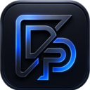
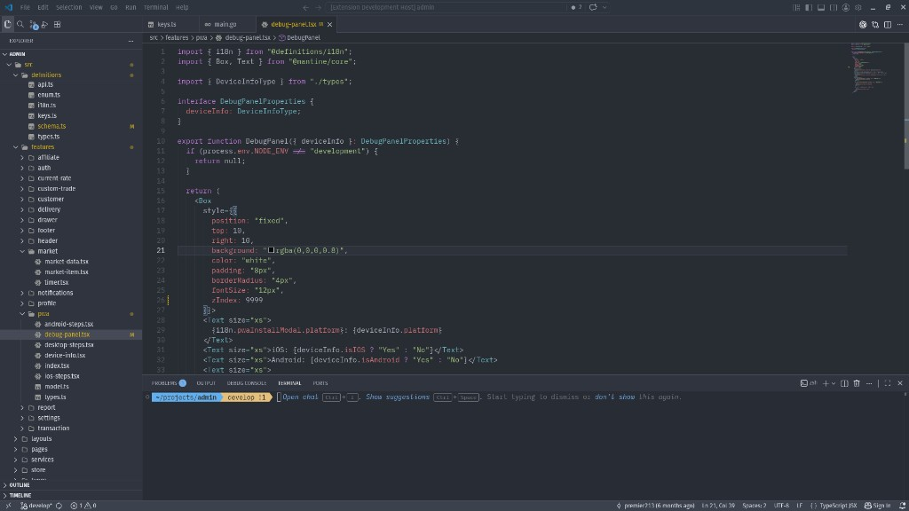

# Zed One Dark for VS Code

<p align="center">
  
</p>

A community-maintained Visual Studio Code port of Zed's built-in **One Dark**
theme, with a matching file icon theme and carefully aligned syntax colors.

> [!IMPORTANT]
> This repository is a fork of
> [`premier213/one-dark-zed`](https://github.com/premier213/one-dark-zed).
> It is not affiliated with, endorsed by, or maintained by Zed Industries,
> Microsoft, or the original repository owner. “Zed” and “Visual Studio Code”
> are used only to identify compatibility and the source of the ported theme.

## Preview



## Included

| Contribution | ID / label | Notes |
| --- | --- | --- |
| Color theme | **Zed One Dark** | Workbench, editor, terminal, semantic-token, and TextMate colors generated from a pinned Zed One Dark palette. |
| File icon theme | **Onedark Zed Icons** (`onedark-zed-icons`) | Icons for common languages, tools, and folders. |

The extension keeps semantic highlighting enabled for Go, including packages,
types, parameters, functions, and methods. Current gopls versions do not expose
a `property` token and classify both ordinary variables and fields such as
`config.Security.Captcha.Secret` as `variable`. The shipped gopls default
therefore disables only that lossy token type; all other semantic roles remain
enabled.

A pinned Go TextMate grammar owns variables, struct fields, selectors,
qualified constants, and composite-literal keys. Member chains consequently
start with their final Zed property color on the first frame instead of being
recolored after navigation. The activation layer remains limited to import
strings, synchronous package-qualifier previews, and the language-neutral
namespace-role correction used by other providers. It no longer applies an
asynchronous Go property decoration.

Package qualifiers follow the role of the symbol they introduce. In Go,
`dal.Instance` and `dal.FindInstanceOption{}` emphasize `dal` because the
qualified symbols are types, while `dal.FindInstanceById(...)` renders `dal`
as an ordinary variable and leaves the callable itself emphasized. Strong
lexical forms are classified on the first frame; semantic tokens provide the
final answer for ambiguous contexts.

## Install

### VS Code Marketplace

Search for **Zed One Dark** in the Extensions view or run:

```powershell
code --install-extension NaroZeol.zed-onedark-vscode
```

### VSIX

Download a `.vsix` from the repository releases, then run **Extensions: Install
from VSIX…** in the Command Palette. From a terminal:

```powershell
code --install-extension .\zed-onedark-vscode-1.3.0.vsix --force
```

To build the package yourself:

```sh
npm ci
npm test
npm run package -- --out zed-onedark-vscode-1.3.0.vsix
```

## Activate

Choose **Preferences: Color Theme → Zed One Dark** and **Preferences: File Icon
Theme → Onedark Zed Icons**, or add:

```json
{
  "workbench.colorTheme": "Zed One Dark",
  "workbench.iconTheme": "onedark-zed-icons"
}
```

## Optional font settings

Fonts are not bundled. Zed's documented monospace default is
[Lilex](https://github.com/mishamyrt/Lilex), which is available separately
under the SIL Open Font License 1.1. A balanced starting point is:

```json
{
  "editor.fontFamily": "Lilex",
  "editor.fontLigatures": true,
  "editor.fontSize": 15,
  "editor.lineHeight": 24,
  "editor.letterSpacing": 0.2
}
```

## Development

The generated theme deliberately has explicit, reproducible inputs:

- `themes/zed-one-theme.upstream.json` is a pinned snapshot of Zed's built-in
  One Dark theme.
- `themes/zed-style-bindings.json`, `themes/zed-ui-bindings.json`, and
  `themes/zed-syntax-mapping.json` define how Zed styles map to VS Code.

Run the theme generator only after changing its inputs:

```sh
npm run sync:theme
npm test
```

The pinned VS Code 1.135.0 TextMate integration suite verifies 340 lexical
tokens across 61 bundled grammars and records 18 classifications that cannot
be derived from those grammars alone. The provider suite separately verifies
238 provider contracts across Go, TypeScript/JavaScript, C/C++, and Rust,
including declaration/reference pairs and properties on both sides of
assignments. Go variable-shaped tokens are intentionally absent from the gopls
stream and covered by the first-frame grammar suite instead. It also checks
namespace qualifiers in both type and runtime-value contexts. The Go test
consumes the same gopls defaults shipped in the
extension manifest so test and editor behavior cannot silently diverge. Point
the TextMate suite at that VS Code installation's `resources/app` directory.
The provider suite requires `gopls`, `clangd`, and `rust-analyzer` on `PATH`:

```sh
VSCODE_APP_ROOT=/path/to/VSCode/resources/app npm run test:vscode
npm run test:semantic
```

Python, shell, JSON/JSONC, HTML, CSS/SCSS, Markdown, YAML, SQL, Java, C#,
PHP, Ruby, and the remaining bundled languages are exercised through their
official VS Code TextMate grammars. An installed language extension may add a
semantic overlay on top of that tested fallback. Separate provider contracts
keep 109 custom token types and modifier rules from Pylance, C#, C/C++,
rust-analyzer, and TOML mapped to the same semantic roles. The provider harness
also rejects newly advertised modifiers until their role precedence is
explicitly classified.

Do not hand-edit generated colors. See
[`docs/DEVELOPMENT_LOG.md`](docs/DEVELOPMENT_LOG.md) for design constraints and
known limitations.

## Provenance and licensing

This fork preserves and extends work from
[`premier213/one-dark-zed`](https://github.com/premier213/one-dark-zed), whose
original portions were published under the MIT License. The palette snapshot
and generated theme incorporate material from
[`zed-industries/zed`](https://github.com/zed-industries/zed), whose unmarked
source and assets are licensed under GPL-3.0-or-later. Some icons include
Lucide/Feather material under ISC/MIT terms.

The combined fork is distributed under **GPL-3.0-or-later**. Required copyright
and permission notices are retained in [`THIRD_PARTY_NOTICES.md`](THIRD_PARTY_NOTICES.md)
and [`icons/icons/LICENSES`](icons/icons/LICENSES). See [`LICENSE`](LICENSE) for
the full project license.
